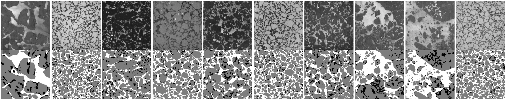

## Overview
This repository accompanies the paper submission "Deep Learning for the Detection of Melt Ponds on Sea Ice from Airborne Infrared Images". It aims to segment helicopter-borne thermal infrared images into three classes: melt pond, sea ice, and ocean. The corresponding full dataset is stored on [PANGAEA](https://doi.org/10.1594/PANGAEA.971908).



With this repository, we provide the following material:
- Labeled training data (TIR images and manual annotations) in ```data/training/```
- Weights of the final fine-tuned UNet++ architecture as presented in the paper, stored in ```final_checkpoints/```
- Surface fraction results of five helicopter flights based on UNet++ classifications in ```runs/```, accompanied by a documentation README.md

The data and weights are git lfs tracked. To be able to use them, please install [git lfs](https://git-lfs.com/).

## Acknowledgments
This project includes code from the following sources:

- [AutoSAM](https://github.com/xhu248/AutoSAM), which is licensed under the [Apache License 2.0](https://www.apache.org/licenses/LICENSE-2.0). The respective code, license, and further information can be found in ```models/```.
- [Segmentation Models](https://github.com/qubvel-org/segmentation_models.pytorch), which is licensed under the MIT license.

AutoSAM itself relies on code from [SAM](https://github.com/facebookresearch/segment-anything/). We gratefully acknowledge all original authors for making their code available.
We further acknowledge the authors of [remote_sensing_pretrained_models](https://github.com/lsh1994/remote_sensing_pretrained_models?tab=readme-ov-file) for making the pre-trained checkpoints publicly available.

## Getting Started
This code requires ```python>=3.10```, as well as ```pytorch>=1.7``` and ```torchvision>=0.8```. Install additional packages using ```pip install -r requirements.txt```.

This repository relies on pre-training checkpoints from the [remote_sensing_pretrained_models](https://github.com/lsh1994/remote_sensing_pretrained_models?tab=readme-ov-file), which is licensed under the Apache License 2.0.
Please download the pre-trained weights from [here](https://github.com/lsh1994/remote_sensing_pretrained_models/releases/). The checkpoints of interest are ```resnet34_224-epoch.9-val_acc.0.966.ckpt``` (AID) and ```resnet34-epoch.19-val_acc.0.921.ckpt``` (RSD46-WHU).

This repository further uses pre-training checkpoints from [SAM](https://github.com/facebookresearch/segment-anything/), licensed under the Apache License 2.0.

Please store all downloaded checkpoints within the respective folders in ```pretraining_checkpoints/```.

## How to Use
1) To run inference: Load the IR temperature netCDF file of the helicopter flight of interest from [PANGAEA](https://doi.org/10.1594/PANGAEA.971908) and store the file in ```data/prediction/temperatures/```. Then execute 
```python -m scripts.run_inference --data "[PATH_TO_TEMPERATURE_FILE]"```
The prediction results will be stored in ```data/prediction/```.

2) To fine-tune the model: Please execute
```python -m scripts.run_smp_finetune --pref "[PREFIX_OF_CHOICE]"```
The final model weights will be stored in ```models/weights/```.

3) To run cross-validation:
```python -m scripts.crossvalidate_smp_torch --final_sweep```

Note that to be executable, the wandb configuration has to be adjusted in the files.

## Related Publications Data
[1] Kanzow, Thorsten (2023). The Expedition PS131 of the Research Vessel POLARSTERN to the Fram Strait in 2022. Ed. by Horst Bornemann and Susan Amir Sawadkuhi. Bremerhaven. DOI: 10.57738/BzPM_0770_2023.

[2] Reil, Marlena; Huntemann, Marcus; Spreen, Gunnar (2024): Helicopter-borne melt pond, sea ice, and ocean surface temperatures with surface type classifications during the Polarstern PS131 ATWAICE expedition in the Arctic during summer 2022 [dataset]. PANGAEA, https://doi.org/10.1594/PANGAEA.971908.


Contact: marlena1@gmx.de
